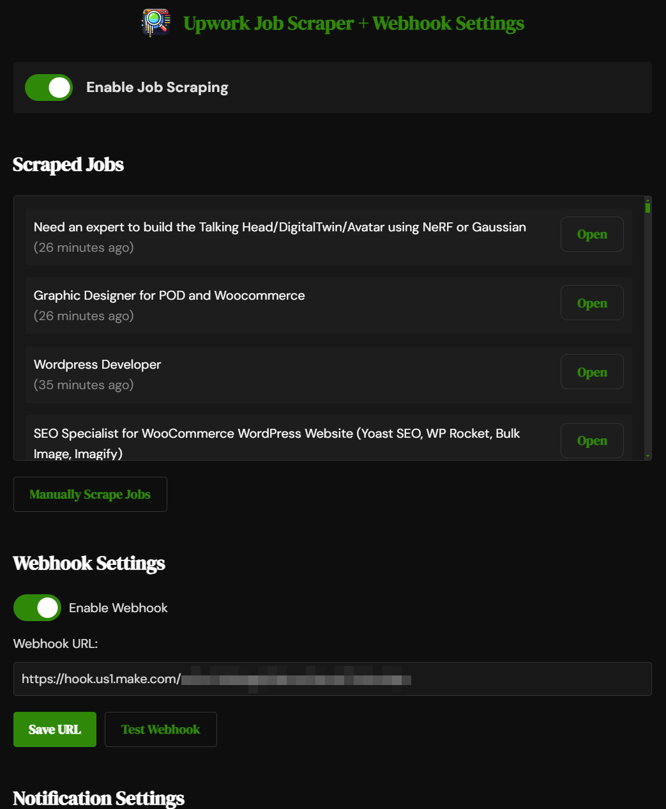

    <h1 align="center">‼️ NOTE: THIS IS UNDER DEVELOPMENT ‼️</h1>
    <h3 align="center">Got questions, feedback, or ideas? Run into any hiccups? Feel free to drop an <a href="https://github.com/richardadonnell/Upwork-Job-Scraper/issues">issue here</a>.</h3>
    
Things might be a little buggy, but hang tight—I'm working hard to keep improving it!

 
 

  

    <h1 align="center">UPWORK JOB SCRAPER + WEBHOOK</h1>

    <em><code>⭐ Chrome Browser Extension ⭐</code></em>

	
	
	
	

  

  Simply click the button above to visit the Chrome Web Store and click "Add to Chrome" to install the extension.

# Upwork Job Scraper + Webhook Chrome Extension

## 🔴👇 HOW TO SETUP VIDEO BELOW 👇🔴

## 🔴👆 HOW TO SETUP VIDEO ABOVE 👆🔴

## Overview

This Chrome extension automatically scrapes job listings from Upwork and sends them to a specified webhook URL. It provides a user-friendly interface for configuring settings, viewing scraped jobs, and monitoring the extension's activity.

## Features

1. 🔍 **Job Scraping**: Automatically scrapes job listings from Upwork at regular intervals.
2. 📊 **Multiple Feed Sources**: Supports scraping from "Most Recent Jobs" or a custom search URL.
3. 🔗 **Webhook Integration**: Sends newly scraped jobs to a user-defined webhook URL.
4. ⏱️ **Customizable Check Frequency**: Allows users to set how often the extension checks for new jobs (in days, hours, and minutes).
5. 🔔 **Browser Notifications**: Optional push notifications for new job alerts.
6. 📝 **Activity Logging**: Keeps a log of the extension's activities for user review.
7. 👀 **View Stored Jobs**: Displays jobs stored locally within the extension's interface.
8. 🔛 **Webhook Toggle**: Enable or disable webhook functionality.
9. 🖱️ **Manual Scraping**: Allows users to trigger a job scrape manually.
10. 🔢 **Badge Notifications**: Shows the number of new jobs since last viewed on the extension icon.
11. 🎛️ **Master Toggle**: Enable or disable all extension functionality.
12. ⏳ **Next Check Countdown**: Displays a countdown to the next scheduled job check.
13. 🐞 **Error Reporting**: Automatically reports errors using Sentry for debugging and logs details to the browser console.
14. ✨ **Job Deduplication**: Avoids sending or notifying about jobs that have already been processed.
15. 🧹 **Data Management**: Provides options within settings to clear stored job data and activity logs.

## Installation

Install the Upwork Job Scraper + Webhook extension directly from the Chrome Web Store:

Simply click the button above to visit the Chrome Web Store and click "Add to Chrome" to install the extension.

## Usage

### Accessing Settings

Click on the extension icon in Chrome to open the settings page.

### Master Toggle

Use the master toggle at the top of the settings page to enable or disable all extension functionality.

### Webhook Configuration

1. Toggle the switch to enable or disable webhook functionality.
2. Enter your webhook URL in the provided input field.
3. Click "Save" to store the URL.
4. Use the "Test Webhook" button to verify your webhook is working correctly.

### Job Check Frequency

Set the frequency for job checks using the following fields:

- Days
- Hours
- Minutes

Click "Save Frequency" to apply the changes.

### Feed Sources

Choose between:

1. Most Recent Jobs
2. Custom Search URL

For Custom Search URL:

1. Select "Custom Search URL" option.
2. Enter the Upwork search URL in the provided field.
3. Click "Save Feed Sources" to apply the changes.

### Notifications

Toggle the switch to enable or disable browser push notifications for new jobs.

### Manual Scraping

Use the "Manually Scrape Jobs" button to initiate an immediate job scrape.

## Development

The extension consists of the following main components:

1. `manifest.json`: Defines the extension's permissions and structure.
2. `background.js`: Handles background processes, job scraping, webhook communication, and error logging.
3. `settings.html` and `settings.js`: Manage the user interface and settings.
4. `settings.css`: Styles the settings page.

To modify the extension:

1. Edit the relevant files.
2. Reload the extension in `chrome://extensions/` to apply changes.

## Testing

To test the webhook functionality:

1. Enable the webhook in the settings.
2. Enter a webhook URL in the settings.
3. Click the "Test Webhook" button.
4. Check your webhook endpoint for the received test data.

To test job scraping:

1. Configure your desired feed source.
2. Click the "Manually Scrape Jobs" button.
3. Check the Activity Log and Scraped Jobs sections for results.

## Permissions

This extension requires the following permissions:

- `storage`: To save user preferences and scraped job data
- `alarms`: For scheduling periodic job checks
- `scripting`: To run scripts on the Upwork website
- `notifications`: For sending browser notifications

## Limitations

- The extension is designed to work specifically with Upwork's job listing pages.
- Frequent scraping may be detected by Upwork and could lead to IP blocking.
- The extension relies on Upwork's current HTML structure; changes to their website may break the scraping functionality.

## Star History

<a href="https://star-history.com/#richardadonnell/Upwork-Job-Scraper&Date">
 <picture>
   <source media="(prefers-color-scheme: dark)" srcset="https://api.star-history.com/svg?repos=richardadonnell/Upwork-Job-Scraper&type=Date&theme=dark" />
   <source media="(prefers-color-scheme: light)" srcset="https://api.star-history.com/svg?repos=richardadonnell/Upwork-Job-Scraper&type=Date" />
   
 </picture>
</a>

## Support

If you found this project helpful, consider supporting the developer:

