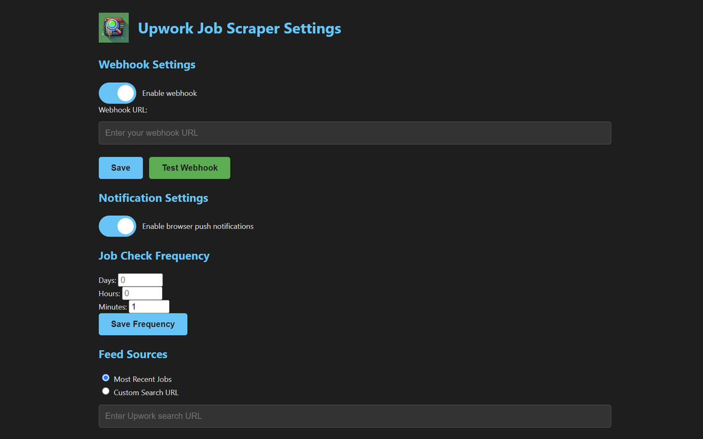

  

    <h1 align="center">UPWORK JOB SCRAPER + WEBHOOK</h1>

    <em><code>⭐ Chrome Browser Extension ⭐</code></em>

	
	
	
	

	<!-- default option, no dependency badges. -->

 

# Upwork Job Scraper + Webhook Chrome Extension

## Overview

This Chrome extension automatically scrapes job listings from Upwork and sends them to a specified webhook URL. It provides a user-friendly interface for configuring settings, viewing scraped jobs, and monitoring the extension's activity.

## Features

1. **Job Scraping**: Automatically scrapes job listings from Upwork at regular intervals.
2. **Multiple Feed Sources**: Supports scraping from "Most Recent Jobs" or a custom search URL.
3. **Webhook Integration**: Sends newly scraped jobs to a user-defined webhook URL.
4. **Customizable Check Frequency**: Allows users to set how often the extension checks for new jobs (in days, hours, and minutes).
5. **Browser Notifications**: Optional push notifications for new job alerts.
6. **Activity Logging**: Keeps a log of the extension's activities for user review.
7. **Job Viewing**: Displays scraped jobs within the extension's interface.
8. **Webhook Toggle**: Enable or disable webhook functionality.
9. **Manual Scraping**: Allows users to trigger a job scrape manually.
10. **Badge Notifications**: Shows the number of new jobs since last viewed on the extension icon.

## Installation

1. Clone this repository or download the source code.
2. Open Chrome and navigate to `chrome://extensions/`.
3. Enable "Developer mode" in the top right corner.
4. Click "Load unpacked" and select the directory containing the extension files.

## Usage

1. Click on the extension icon in Chrome to open the settings page.
2. Configure the webhook URL where you want to receive job data.
3. Set the desired job check frequency.
4. Choose between "Most Recent Jobs" or "Custom Search URL" as your feed source.
5. Enable or disable browser notifications and webhook functionality as needed.
6. View scraped jobs and the activity log directly in the settings page.
7. Use the "Manually Scrape Jobs" button to trigger an immediate job scrape.

## Configuration

### Webhook Setup

1. Toggle the switch to enable or disable webhook functionality.
2. Enter your webhook URL in the provided input field.
3. Click "Save" to store the URL.
4. Use the "Test Webhook" button to verify your webhook is working correctly.

### Job Check Frequency

Set the frequency for job checks using the following fields:
- Days
- Hours
- Minutes

Click "Save Frequency" to apply the changes.

### Feed Sources

Choose between:
1. Most Recent Jobs
2. Custom Search URL

For Custom Search URL:
1. Select "Custom Search URL" option.
2. Enter the Upwork search URL in the provided field.
3. Click "Save Feed Sources" to apply the changes.

### Notifications

Toggle the switch to enable or disable browser push notifications for new jobs.

## Development

The extension consists of the following main components:

1. `manifest.json`: Defines the extension's permissions and structure.
2. `background.js`: Handles background processes, job scraping, and webhook communication.
3. `settings.html` and `settings.js`: Manage the user interface and settings.

To modify the extension:

1. Edit the relevant files.
2. Reload the extension in `chrome://extensions/` to apply changes.

## Testing

To test the webhook functionality:

1. Enable the webhook in the settings.
2. Enter a webhook URL in the settings.
3. Click the "Test Webhook" button.
4. Check your webhook endpoint for the received test data.

To test job scraping:

1. Configure your desired feed source.
2. Click the "Manually Scrape Jobs" button.
3. Check the Activity Log and Scraped Jobs sections for results.

## Permissions

This extension requires the following permissions:

- `storage`: To save user preferences and scraped job data
- `alarms`: For scheduling periodic job checks
- `tabs`: To create a tab for job scraping
- `scripting`: To run scripts on the Upwork website
- `notifications`: For sending browser notifications
- `action`: To handle extension icon clicks

## Limitations

- The extension is designed to work specifically with Upwork's job listing pages.
- Frequent scraping may be detected by Upwork and could lead to IP blocking.
- The extension relies on Upwork's current HTML structure; changes to their website may break the scraping functionality.

## Contributing

Contributions to improve the extension are welcome. Please follow these steps:

1. Fork the repository
2. Create a new branch for your feature
3. Commit your changes
4. Push to the branch
5. Create a new Pull Request

## License

This project is licensed under the GNU General Public License v3.0 (GPL-3.0).

GNU General Public License v3.0 (GPL-3.0)

This program is free software: you can redistribute it and/or modify
it under the terms of the GNU General Public License as published by
the Free Software Foundation, either version 3 of the License, or
(at your option) any later version.

This program is distributed in the hope that it will be useful,
but WITHOUT ANY WARRANTY; without even the implied warranty of
MERCHANTABILITY or FITNESS FOR A PARTICULAR PURPOSE. See the
GNU General Public License for more details.

You should have received a copy of the GNU General Public License
along with this program. If not, see <https://www.gnu.org/licenses/>.

For the full license text, please see the LICENSE file in the root directory of this source tree or visit https://www.gnu.org/licenses/gpl-3.0.html.

## Disclaimer

This extension is for educational purposes only. Use it responsibly and in accordance with Upwork's terms of service. The authors are not responsible for any misuse or violation of Upwork's policies.

## Support My Work

If you found this repository helpful and would like to show your support, consider buying me a coffee! Your contribution helps keep this project going. 

